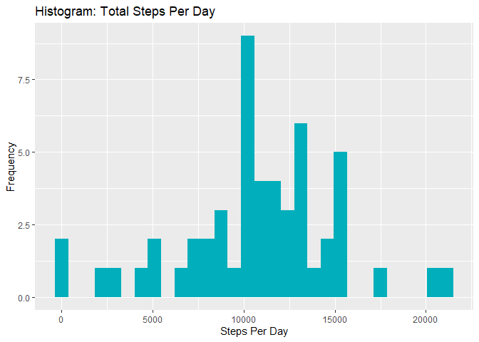
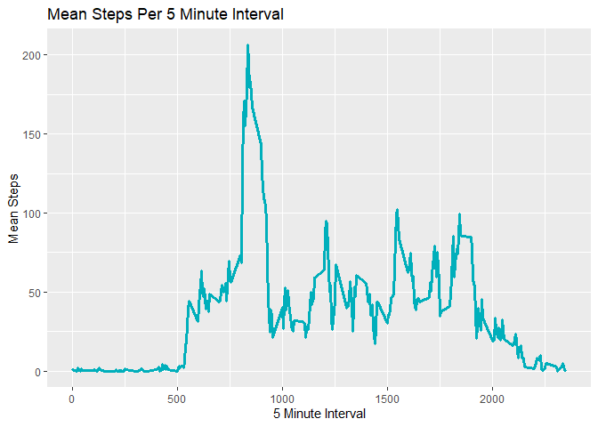
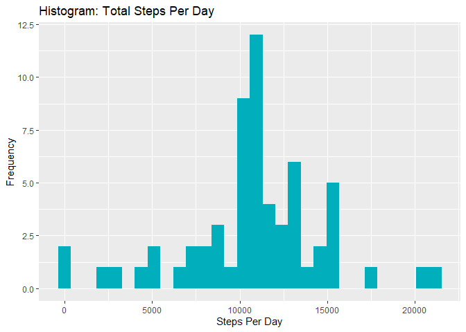
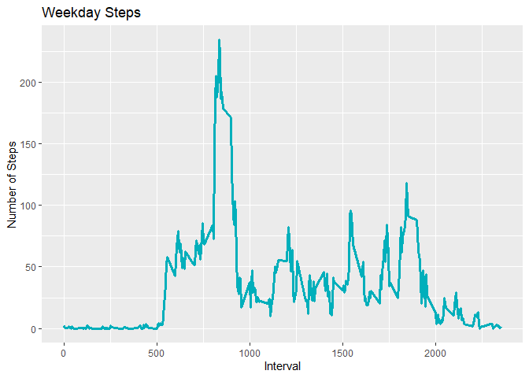
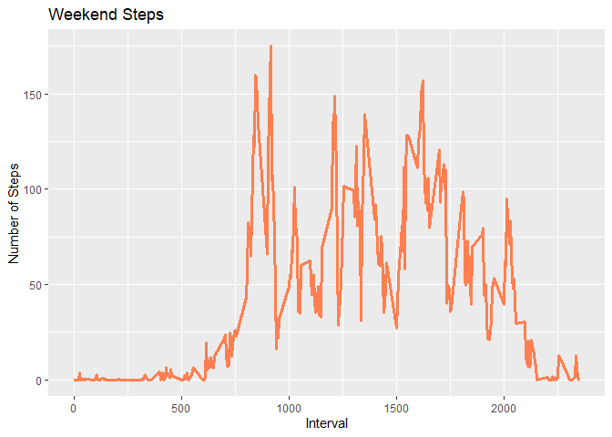

```r
knitr::opts_chunk$set(echo = TRUE)
```
## Load libraries

```r
require(dplyr)
require(tidyr)
require(ggplot2)
require(lubridate)
```

## Loading and preprocessing the data

```r
rawActivityData <- read.csv('activity.csv')
```
## What is mean total number of steps taken per day?

```r
#Create Day Column
activityData <- mutate(rawActivityData, day = ymd(rawActivityData$date))

#Group data by Day
activityByDay <- activityData %>% group_by(day)

#Calculate Mean Steps
sumActivityByDay <- summarize(activityByDay, meanSteps = mean(steps, na.rm =FALSE),medianSteps = median(steps, na.rm = FALSE),totalSteps = sum(steps,na.rm = FALSE))

meanStepsPerDay <- mean(sumActivityByDay$totalSteps, na.rm = TRUE)
medianStepsPerDay <- median(sumActivityByDay$totalSteps, na.rm = TRUE)
```
The mean steps per day are 1.0766189\times 10^{4}
The median steps per day are 10765


```r
#Create the Plot
ggplot(sumActivityByDay, aes(x=totalSteps)) + 
  geom_histogram(fill = '#00AFBB')+
  labs(x='Steps Per Day', y = 'Frequency', title ='Histogram: Total Steps Per Day')
```

<!-- -->

## What is the average daily activity pattern?

```r
#Group data by interval
activityByInterval <- activityData %>% group_by(interval)

#Calculate Mean per Interval
meanActivityByInterval <- summarize(activityByInterval, meanSteps = mean(steps, na.rm =TRUE))

#Create The Time Series Plot
ggplot(meanActivityByInterval, aes(x= interval, y=meanSteps))+
  geom_line(color = "#00AFBB", size = 1.2)+
  labs(x='5 Minute Interval', y = 'Mean Steps', title ='Mean Steps Per 5 Minute Interval')
```

<!-- -->

```r
#Maximum Steps per 5' Interval
print (maxInterval <- activityData %>% group_by(interval) %>% 
  summarize(meanByInterval = mean(steps, na.rm = TRUE)) %>%
  filter(meanByInterval == max(meanByInterval)))
```

```
## # A tibble: 1 x 2
##   interval meanByInterval
##      <int>          <dbl>
## 1      835           206.
```
## Imputing missing values

```r
#Calculate Total number of missing values
print(missingValues <- sum(is.na(activityData)))
```

```
## [1] 2304
```

```r
#Calculate the mean steps per interval
print(meanStepsPerInterval <- mean(meanActivityByInterval$meanSteps, na.rm = TRUE))
```

```
## [1] 37.3826
```

```r
#Create a Variable for the data with No NA's
activityDataNoNA <- activityData

# Replace the NA data with Mean Steps Per Interval
activityDataNoNA[is.na(activityDataNoNA)] <- 37

#Verify that missing data has been replaced
print(missingValuesNoNA <- sum(is.na(activityDataNoNA$steps)))
```

```
## [1] 0
```

```r
#Group data by Day
activityByDayNoNA <- activityDataNoNA %>% group_by(day)

#Calculate Mean Steps
sumActivityByDayNoNA <- summarize(activityByDayNoNA ,totalSteps = sum(steps,na.rm = FALSE))

#Create the Plot
ggplot(sumActivityByDayNoNA, aes(x=totalSteps)) + 
  geom_histogram(fill = '#00AFBB')+
  labs(x='Steps Per Day', y = 'Frequency', title ='Histogram: Total Steps Per Day')
```

<!-- -->

```r
#Display the Mean & Median Steps Per Day
print(meanStepsPerDayNoNA <- mean(sumActivityByDayNoNA$totalSteps, na.rm = TRUE))
```

```
## [1] 10751.74
```

```r
print(medianStepsPerDayNoNA <- median(sumActivityByDayNoNA$totalSteps, na.rm = TRUE))
```

```
## [1] 10656
```

## Are there differences in activity patterns between weekdays and weekends?

```r
#Calculate the weekend based on day of the week
weekdayCompareWeekendCalc1 <- activityData %>% mutate(dayOfWeek = weekdays(day)) %>%
  mutate(Weekend = ifelse(dayOfWeek == "Saturday" | dayOfWeek == "Sunday", "Weekend", "Weekday"))

#Filter Weekend and Weekday Activities
actWeekday <- filter(weekdayCompareWeekendCalc1, Weekend == "Weekday")
actWeekend <- filter(weekdayCompareWeekendCalc1, Weekend == "Weekend")

#Group data by interval
actWeekdayByInterval <- actWeekday %>% group_by(interval)%>% summarize(meanSteps = mean(steps, na.rm =TRUE))

actWeekendByInterval <- actWeekend %>% group_by(interval)%>% summarize(meanSteps = mean(steps, na.rm =TRUE))

#Plot Weekday Steps
 ggplot(actWeekdayByInterval ,aes(x = interval, y = meanSteps)) + 
  geom_line(color = "#00AFBB", size = 1.1)+
  labs(x='Interval', y = 'Number of Steps', title ='Weekday Steps')
```

<!-- -->

```r
ggplot(actWeekendByInterval ,aes(x = interval, y = meanSteps)) + 
  geom_line(color = "#FF7F50", size = 1.1)+
  labs(x='Interval', y = 'Number of Steps', title ='Weekend Steps')
```

<!-- -->
